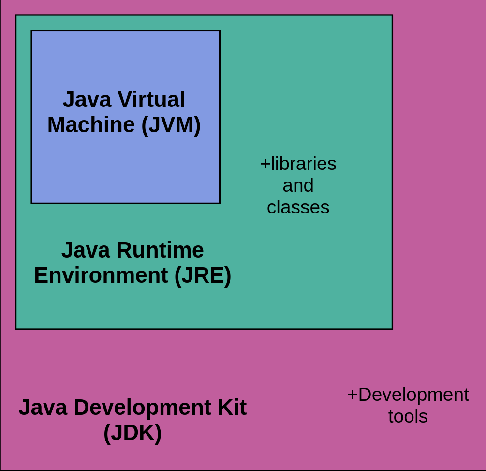
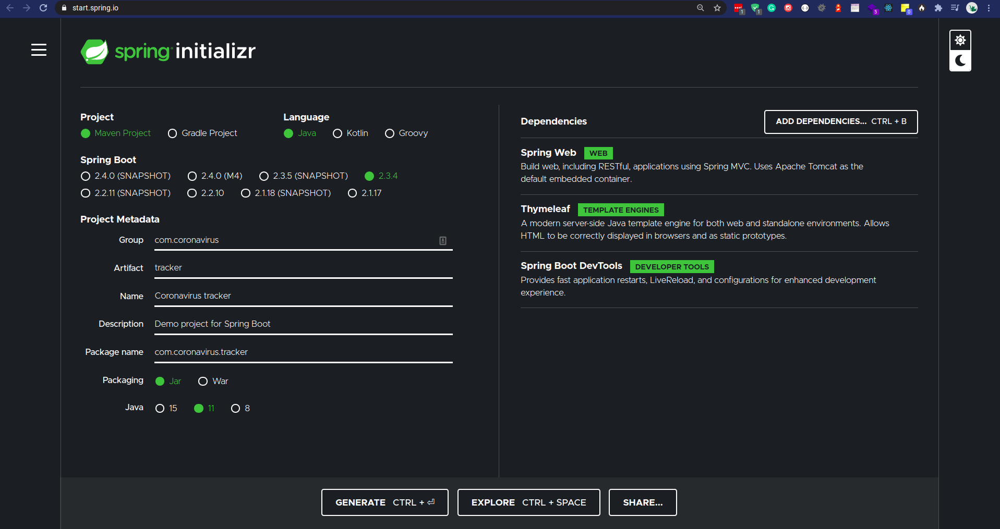
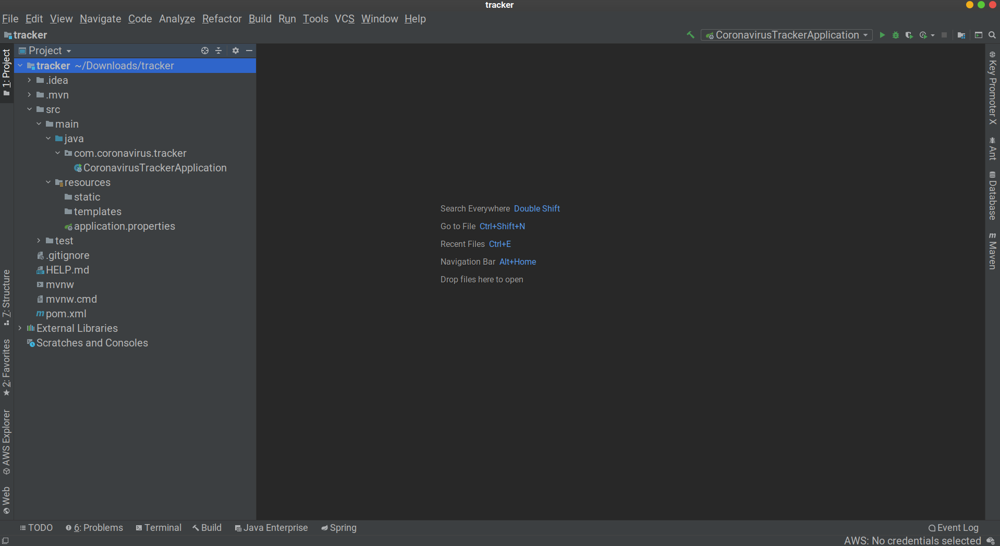
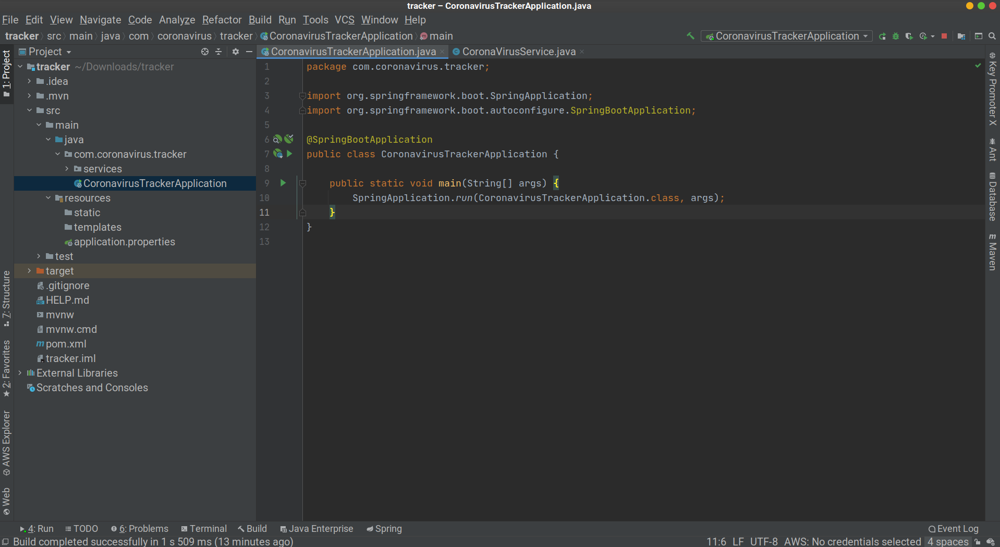

# Title: Coronavirus tracker app with spring-boot
- Duration: `4 hours`
- Deployment strategy : Own PC
- Team challenge : `solo`
## Learning objectives
- To be able to install java
- Be able to work in java environment
- Gain more insight into the Spring-boot
- Be able to work with dependencies in spring boot
- Learn how to work with mvc patterns
- Be able to fetch data from csv file and be able to display it
- Be able to send http request and response
- Be able to work with Thymeleaf template engine
## The Mission
Today we are going to make a coronavirus tracker application which tracks all the cases that occurs and updates it daily. 

#### Step 1: What is Java development kit or in short JDK ?
The Java Development Kit (JDK) is a software development environment that offers a collection of tools and libraries necessary for developing Java applications. You need the JDK to convert your source code into a format that the Java Runtime Environment (JRE) can execute.

The JDK includes the Java Runtime Environment (JRE), an interpreter (java), a compiler (javac), an archiver (jar), a documentation generator (javadoc), and some other development tools. The Java Runtime Environment itself consists of the Java Virtual Machine (JVM), supporting files, and core classes.



Typically, if you are only interested in running Java programs on your machine or browser, you only need to install JRE. However, if you would like to develop an application and do Java programming, you will need JDK.

**Since April 16, 2019, you have to create an account in order to be able to download [JDK](https://www.oracle.com/java/technologies/javase-jdk11-downloads.html)**


#### Step 2: Install Maven
Apache Maven is a cornerstone of Java development, and the most used build management tool for Java. Maven's streamlined, XML-based configuration model enables developers to rapidly describe or grasp the outlines of any Java-based project, which makes starting and sharing new projects a snap. Maven also supports test-driven development, long-term project maintenance, and its declarative configuration and wide range of plugins make it a popular option for CI/CD. This article is a quick introduction to Maven, including the Maven POM and directory structure, and commands for building your first Maven project.

You can install by pasting this command in your terminal:

` sudo apt-get install maven `


#### Step 3: Code editor for java development
In order to be able to code java, you need an editor. As I assume that you are already used to phpstorm to code PHP, Then I think you will love **[Intellij](https://www.jetbrains.com/idea/download/#section=linux)** because it's full of features, simple, neat and clean from the same Brand as phpstorm.

On Ubuntu?
IntelliJ IDEA is also available as a snap package. If you’re on Ubuntu 16.04 or later, you can install IntelliJ IDEA from the command line.

` sudo snap install intellij-idea-ultimate --classic `

I would recommend Intellij but if Intellij is not for you then I have got you covered you can install **[Eclipse](https://www.eclipse.org/downloads/download.php?file=/oomph/epp/2020-09/R/eclipse-inst-jre-linux64.tar.gz)** another great editor for java.


#### Step 4: Spring Initializr
If you’re wondering how to use start.spring.io or what features are available, this section is for you! You’ll find the various ways you can interact with the service and get a better insight at what you can do with it.

The service allows you to generate Spring Boot projects quickly. You can customize the project to generate: the build system and packaging, the language, the packaging, the coordinates, the platform version and, finally, the dependencies to add to the project. Most dependencies available on start.spring.io are Spring Boot starters which is the recommended way to add dependencies to a Spring Boot application.

**Getting Started**

Let’s create a project and discover the various options that you can use to tune it. Go to **[start.spring.io](https://start.spring.io)**, change the Group field from "com.example" to "com.coronavirus", change the Artifact from demo to "tracker", change the Name to "Coronavirus tracker", for the description you can write whatever you want. Click on the "add dependency" in the top right corner and type and add the "Spring web", "ThymeLeaf" and "Spring boot devTools" dependencies.

**Your browser should now be in this state:**




**Ok let's go through every option on this website.**

- Project: It defines the kind of project. We can create either Maven Project or Gradle Project. We will create a Maven Project throughout the exercise.

- Language: Spring Initializr provides the choice among three languages Java, Kotlin, and Groovy. Java is by default selected.

- Spring Boot: Which Spring Boot version to use. For this exercise we are going to use 2.3.4.

- Group: Group the root package name to use.

- Artifact: Artifact is the name of the project/application.

- Name: Display name of the project that also determines the name of your Spring Boot application. For instance, if the name of your project is my-app, the generated project will have a MyAppApplication class

- Description: description of the project

- Package Name: root package of the project. If not specified, the value of the Group attribute is used

- Packaging: project packaging (as referred by the concept of the same name in Apache Maven). start.spring.io can generate jar or war projects

- Spring boot: the spring boot version to use

- Java: We can select the JVM version which we want to use. We will use Java 11 version throughout the exercise.

- Add Dependencies: Dependencies are the collection of artifacts that we can add to our project.

**Now click on the Generate button and it will download the initial project files.**

#### Step 5: Getting started with exercise

After downloading the initial project files, Extract it and open it in Intellij. After opening it in Intellij, you will see that Maven is creating and downloading all the initial files and dependencies for you.

**It should look like this:**



As you can see that there bunch of files and folders inside this project.

- mvn: this the folder from mvn builder. we are not going to touch this folder.

- src: this the folder where we are going to write all our code. if you open src/main/java/com.coronavirus.tracker, you will see a class CoronavirusTrackerApplication. The class is the entry point into the application.


- src/main/resources: this is the folder where our front-end logic and resources lies.

- test: well here you can write all your unit test here.

- target: Once you click on the run button or shift+F10 to run your application you will see that target folder is created. This folder contains all the compiled bytecodes of your application.

- pom.xml: A Project Object Model or POM is the fundamental unit of work in Maven. It is an XML file that contains information about the project and configuration details used by Maven to build the project. It contains default values for most projects. Examples for this is the build directory, which is target; the source directory, which is src/main/java; the test source directory, which is src/test/java; and so on. When executing a task or goal, Maven looks for the POM in the current directory. It reads the POM, gets the needed configuration information, then executes the goal.
           Some of the configuration that can be specified in the POM are the project dependencies, the plugins or goals that can be executed, the build profiles, and so on. Other information such as the project version, description, developers, mailing lists and such can also be specified.

**Make sure that your Project bytecode version is 11 in your editor settings and project's version is 11 and also in your pom.xml file**

Today we are going to build an application that fetches data from a source, maybe your thinking about API but no today I want it to do it a little different. We are going to fetch all our data from a github account from **[Center for Systems Science and Engineering (CSSE) at Johns Hopkins University](https://github.com/CSSEGISandData/COVID-19)**. It is updated daily.

#### Step 6: Let's start with coding enough with theory and explanation
##### 1: Create a package called "services" by right clicking on com.coronavirus.tracker. Now inside that package create a new class called "CoronaVirusService". It is the service that is going to fetch all the data and when our application loads it is going to send a call to this **[URL](https://raw.githubusercontent.com/CSSEGISandData/COVID-19/master/csse_covid_19_data/csse_covid_19_time_series/time_series_covid19_confirmed_global.csv)** which is in csv format.

Inside your CoronaVirusService class. Create a static type String property:

```
    private static String CORONA_VIRUS_DATA_URL = "https://raw.githubusercontent.com/CSSEGISandData/COVID-19/master/csse_covid_19_data/csse_covid_19_time_series/time_series_covid19_confirmed_global.csv";
```

Next, create a void method that is going to fetch all data from the property that we have created.
```
   public void fetchUrlData() {
   	
       } 
```

Now inside this method create new HttpClient variables in order to be able to send and receive http requests and printing it out.

```
   public void fetchUrlData() {
        HttpClient client = HttpClient.newHttpClient();
        HttpRequest request = HttpRequest.newBuilder()
                .uri(URI.create(CORONA_VIRUS_DATA_URL))
                .build();
        HttpResponse<String> httpResponse = client.send(request, HttpResponse.BodyHandlers.ofString());
        System.out.println(httpResponse.body());
       } 
```

After pasting this code you will see that there are a lot of red errors in your code but don't worry you have to only hover over those red errors and import it.
Now click on the run button on top right. If you want to use shortcut press ctrl+F5 or shift+F10. It will start your server and your Run window will pop up.
You will see that nothing is printing on the console. You are thinking why is that, I have written everything correct but nothing prints. Well, welcome to the world of magic :P I mean spring Boot.
Let me explain here. In order to spring boot know that your CoronaVirusService is a service class, 
you have to write this annotation **@Service** above the CoronaVirusService class and **@PostConstruct** above the fetchUrlData method. Well PostContruct annotation means that whenever this CoronaVirusService class is instantiated run this method too.


Now, if you run your program again by clicking the run button or pressing shift+F10. You will see that now we are able to fetch all the data from the URL. As you can see all the data that received are in csv format, we have to convert it to string. In order to do that we need a **[csv parser](https://commons.apache.org/proper/commons-csv/index.html)** that parses csv files into string. Add this dependency into your POM.xml file inside dependencies section and save it.
```
<dependency>
    <groupId>org.apache.commons</groupId>
    <artifactId>commons-csv</artifactId>
    <version>1.8</version>
</dependency>
```

You can read more [here](https://commons.apache.org/proper/commons-csv/user-guide.html).

if it is still red then you have to reload the maven project in order to download the dependency. you can do that by clicking on the maven left sidebar and click on reload all maven projects icon.

##### 2: In order to save all data in our application state we need a model
Create a **models** package inside com.coronavirus.tracker and create a new class inside model called **LocationStats**.
Inside LocationStats create 4 properties with getters and setters:
```
    private String state;
    private String country;
    private int latestTotalCases;
    private int diffFromPrevDay;
```

In order to print our locations stats and numbers we need to call a method toString(). You can do that by alt+insert or just copy past this code below:
```
    @Override
    public String toString() {
        return "LocationStats{" +
                "state='" + state + '\'' +
                ", country='" + country + '\'' +
                ", latestTotalCases=" + latestTotalCases +
                ", diffFromPrevDay=" + diffFromPrevDay +
                '}';
    }
```

##### 3: Go back to CoronavirusService class
Here we have to save those data inside our model that we have received from the source

create a new ArrayList of LocationStats with getter.

```
    private List<LocationStats> allStats = new ArrayList<>();

    public List<LocationStats> getAllStats() {
        return allStats;
    }
```

As you have seen that there are a lot of records inside csv file. We have to loop through every records and print out the country, province, lastest cases and previous day cases.


Your code should look like this:
```
@Service
public class CoronaVirusService {
    private static String CORONA_VIRUS_DATA_URL = "https://raw.githubusercontent.com/CSSEGISandData/COVID-19/master/csse_covid_19_data/csse_covid_19_time_series/time_series_covid19_confirmed_global.csv";

    private List<LocationStats> allStats = new ArrayList<>();

    public List<LocationStats> getAllStats() {
        return allStats;
    }

    @PostConstruct
    public void fetchUrlData() throws IOException, InterruptedException {
        List<LocationStats> newStats = new ArrayList<>();
        HttpClient client = HttpClient.newHttpClient();
        HttpRequest request = HttpRequest.newBuilder()
                .uri(URI.create(CORONA_VIRUS_DATA_URL))
                .build();
        HttpResponse<String> httpResponse = client.send(request, HttpResponse.BodyHandlers.ofString());
        StringReader csvBodyReader = new StringReader(httpResponse.body());
        Iterable<CSVRecord> records = CSVFormat.DEFAULT.withFirstRecordAsHeader().parse(csvBodyReader);
        for (CSVRecord record : records) {
            LocationStats locationStat = new LocationStats();
            locationStat.setState(record.get("Province/State"));
            locationStat.setCountry(record.get("Country/Region"));
            int latestCases = Integer.parseInt(record.get(record.size() - 1));
            int prevDayCases = Integer.parseInt(record.get(record.size() - 2));
            locationStat.setLatestTotalCases(latestCases);
            locationStat.setDiffFromPrevDay(latestCases - prevDayCases);
            newStats.add(locationStat);
        }
        this.allStats = newStats;
    }
}

```

Ok let me explain this. First we are fetching the csv data from the url and in order to format csv data with apache commons CSV we have to pass the httpResponse as a StringReader.
And then we loop through every record and save all the records in our model.
 
 Our application only shows data once it is accessed, because the data we receive is daily updated and we have to update it accordingly.
 That's where spring boot annotation comes in handy. Add this annotation on fetchUrlData method and below @PostConstruct
```
@Scheduled(cron = "* * 1 * * *")
```
and add also **@EnableScheduling** on the entry CoronavirusTrackerApplication class. Well this enables scheduling on our application to run every day.
Every star inside @Scheduled means second,minute,hour,day,month,year.

##### 4: In order to render all data we need a controller
Create a new package inside com.coronavirus.tracker called **controllers** and inside that controllers create a new class **HomeController** or whatever you like.
In order to let spring boot know that we are using this class as a controller we have to add **@Controller** annotation on the HomeController class.

Ok now create a public string index method which will return a template value.
```
@Controller
public class HomeController {
    public String index() {
        return "home";
    }
}
```

Since we are returning a home template we have to create a home.html inside resources/templates. Once you have created your home.html, add **@GetMapping("/")** which handles GET requests.
You can test it out by writing something inside your html and navigate to **locahost:8080**. 

**Make sure that your html file and whatever you return inside your controller should have the same name**.

##### 5: Autowiring service to controller
create a property (type CoronaVirusService) inside your controller and add **@Autowired** on top of it like this:
```
@Autowired
CoronaVirusService coronaVirusService;
```
Let me explain this: Spring @Autowired annotation is used for automatic dependency injection. Spring framework is built on dependency injection and we inject the class dependencies through spring bean configuration file.

Now pass **Model model** inside your index method
```
@Controller
public class HomeController {
    public String index(Model model) {
        return "home";
    }
}
```
What is Model interface ? 

Spring mvc Model interface is used for adding attributes used to replace placeholders in a view.

Now create three variables where we will store our allstats, totalReportedCases, totalNewCases
```
List<LocationStats> allStats = coronaVirusService.getAllStats();
int totalReportedCases = allStats.stream().mapToInt(LocationStats::getLatestTotalCases).sum();
int totalNewCases = allStats.stream().mapToInt(LocationStats::getDiffFromPrevDay).sum();
```

Here we are storing all stats inside an ArrayList and adding all of the total cases inside totalReportedCases. For totalNewCases we are subtracting the total previous day cases from latest cases and adding them all together.

Now in order to be able to access data from controller inside our html page, we need to create model.addAttributes() and pass this variables.
```
@Controller
public class HomeController {

    @Autowired
    CoronaVirusService coronaVirusService;

    @GetMapping("/")
    public String index(Model model) {
        List<LocationStats> allStats = coronaVirusService.getAllStats();
        int totalReportedCases = allStats.stream().mapToInt(LocationStats::getLatestTotalCases).sum();
        int totalNewCases = allStats.stream().mapToInt(LocationStats::getDiffFromPrevDay).sum();
        model.addAttribute("locationStats", allStats);
        model.addAttribute("totalReportedCases", totalReportedCases);
        model.addAttribute("totalNewCases", totalNewCases);
        return "home";
    }
}
```

##### 6: Open your index.html
Now its front-end time!
Copy and paste this code:

Don't worry I will try to explain this code.
```
<!DOCTYPE html>

<html xmlns:th="http://www.thymeleaf.org">

<head>
    <title>Coronavirus Tracker Application</title>
    <meta http-equiv="Content-Type" content="text/html; charset=UTF-8"/>
    <meta name="viewport" content="width=device-width, initial-scale=1, shrink-to-fit=no">
    <link rel="stylesheet" href="https://cdn.jsdelivr.net/npm/bootstrap@4.5.3/dist/css/bootstrap.min.css"
          integrity="sha384-TX8t27EcRE3e/ihU7zmQxVncDAy5uIKz4rEkgIXeMed4M0jlfIDPvg6uqKI2xXr2"
          crossorigin="anonymous">
</head>

<body>
<div class="container">
    <h1>Total cases reported</h1>

    <p>This application lists the current number of cases reported across the globe</p>

    <div class="jumbotron">
        <h1 class="display-4" th:text="${totalReportedCases}"></h1>
        <p class="lead">Total cases reported as of today</p>
        <hr class="my-4">
        <p>
            <span>Total new cases reported since yesterday</span>
            <span th:text="${totalNewCases}"></span>
        </p>
    </div>

    <table class="table table-bordered table-hover">
        <thead class="thead-dark">
        <tr>
            <th>Country</th>
            <th>Province</th>
            <th>Total cases reported</th>
            <th>Confirmed cases since last day</th>
        </tr>
        </thead>
        <tr th:each="locationStat : ${locationStats}">
            <td class="table-primary" th:text="${locationStat.country}"></td>
            <td class="table-primary" th:text="${locationStat.state}"></td>
            <td class="table-secondary" th:text="${locationStat.latestTotalCases}">0</td>
            <td class="table-danger" th:text="${locationStat.diffFromPrevDay}">0</td>
        </tr>
    </table>
</div>
</body>

</html>
```
As you can see we have passed the same totalReportedCases and totalNewCases attributes that we have created inside our controller class and looped through the records and display them in a table.

if your more curious about Thymeleaf syntax you can find more information [here](https://www.thymeleaf.org/doc/tutorials/3.0/usingthymeleaf.html#introducing-thymeleaf)

#### 7: Congratulations you are now a spring boot Rockstar developer!

### Nice to have features
- Display totalRecoveredCases

- Display totalDeathCases

### Useful Resources
[Spring Boor guides](https://spring.io/guides)

[]()


